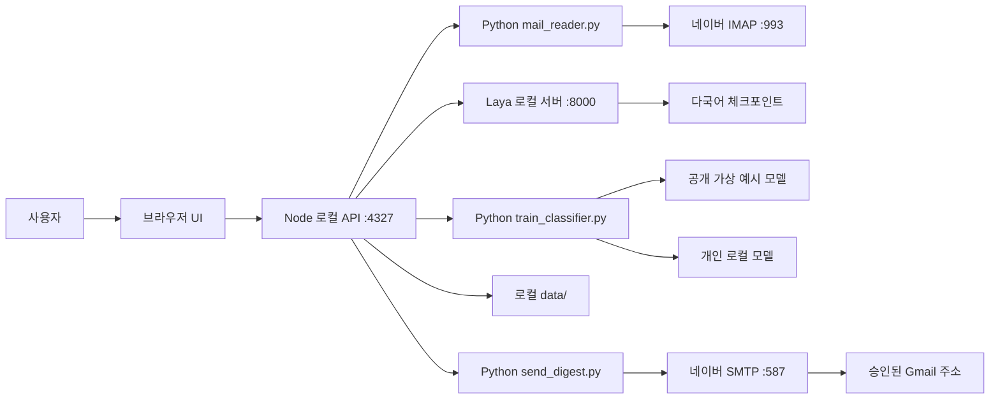

# 개발명세서

## 1. 프로젝트 식별

- 프로젝트명: **Naver Laya Mail Triage**
- 추천 GitHub 저장소명: `naver-laya-mail-triage`
- 목적: 개인 네이버 메일을 로컬에서 읽고 분류·검토한 다음, 즉시 승인하거나 미응답 60초가 지나면 지정된 Gmail로 요약을 발송한다.
- 대상 환경: Windows 단일 사용자 PC. 공용 웹 서버나 다중 사용자 서비스가 아니다.
- 기본 주소: 앱 `127.0.0.1:4327`, Laya 서버 `127.0.0.1:8000`.
- 모델 계열 설명: [Jev](https://typesafe.ai/blog/introducing-system-one-models-and-jev)와 마찬가지로 상태와 타입이 지정된 질문에서 결정을 얻는 System One 방식. Laya 서버는 원저장소에서 Jev-compatible HTTP 형식을 표방한다. 동일한 모델이나 성능을 의미하지 않는다.

## 2. 기능 범위

1. 네이버 IMAP 연결 확인, 최신 메일 수집, 읽음 상태 보존 확인.
2. Laya 모델의 카테고리·긴급도·답장 필요 판단.
3. 검토 정답 기억, 공개 기본 분류기 또는 개인 로컬 분류기를 이용한 카테고리 보정.
4. 명시적 긴급도 규칙 적용, 원문 확인, 카테고리·긴급도·답장 여부 수동 수정.
5. 진행 단계와 중단, 선택 결과 JSON 내보내기.
6. 분류 종료 후 승인 미리보기, `예` 즉시 발송, `아니오` 취소, 미응답 60초 후 자동 발송.

브라우저 로그인 자동화, 네이버 메일 상태 변경, Laya 가중치 파인튜닝, 클라우드 AI API 연동은 범위 밖이다.

## 3. 기술 스택

| 계층 | 기술 | 역할 |
| --- | --- | --- |
| 화면 | HTML, CSS, 브라우저 JavaScript | 로컬 분류 목록, 검토, 승인 화면 |
| 앱 서버 | Node.js 24, ES modules, 내장 `http`/`fs`/`child_process` | 로컬 API, 작업 상태, 파일 저장, Python 프로세스 실행 |
| 메일 수집 | Python 3.12 표준 라이브러리 `imaplib`, `email` | 네이버 IMAP 조회와 MIME 본문 추출 |
| 메일 발송 | Python 표준 라이브러리 `smtplib`, `email` | 승인된 요약을 네이버 SMTP로 발송 |
| 기본 판단 | Laya 0.3.22 `multilingual` 체크포인트 | 로컬 선택지 기반 카테고리·긴급도·답장 판단 |
| 보조 분류 | scikit-learn 1.9.1, joblib 1.6.0 | 검토 정답 또는 가상 예시를 통한 카테고리 제안 |
| 데이터 | 로컬 JSON, `.env`, joblib | 결과·승인 상태·설정·개인 학습 산출물 |
| 실행 | `setup.bat`, `run-app.bat`, PowerShell | 설치 및 앱/모델 서버 시작 |

Node 런타임 의존 패키지는 없으며 `package.json`의 `private: true`는 npm 패키지 배포를 막는다. Python 의존성은 `requirements.txt`에 고정했다. Laya 소스는 [원저장소](https://github.com/NandhaKishorM/laya)의 특정 커밋에서 설치되며 이 저장소에 복사하지 않는다.

## 4. 전체 구조

### 주요 파일

| 파일 | 책임 |
| --- | --- |
| `index.html` | 단일 화면 UI, 진행 상황, 검토·승인 상호작용 |
| `server.mjs` | HTTP API, 분류 작업 조정, 저장과 승인 상태 |
| `mail_reader.py` | IMAP 접속, 읽기 전용 수집, 본문 파싱 |
| `triage.mjs` | Laya 질문, 응답 정규화, 긴급도 규칙 |
| `corrections.mjs` | 과거 검토 정답과 유사한 메일의 카테고리 보정 |
| `train_classifier.py` | 가상 예시/개인 모델 추론, 개인 모델 재학습·검증 |
| `build_public_seed.py` | 가상 예시로 공개 기본 분류기 재생성 |
| `digest.mjs` | 분류별 텍스트/HTML 요약 및 긴급 강조 |
| `approval-policy.mjs` | 미응답 60초 자동 발송의 시간·조건 판정 |
| `send_digest.py` | 네이버 SMTP TLS 발송 |
| `env-config.mjs` | 로컬 `.env`의 계정·수신 주소 로드/저장 |
| `run-app.ps1`, `start-model.ps1` | 로컬 서버 실행과 모델 환경 설정 |

## 5. Laya 모델 사용 방식

Laya는 일반적인 채팅형 LLM이 아니라 상태(`state`)와 질문(`questions`), 선택 기준(`criteria`)을 입력받아 판단을 반환하는 **비자동회귀 결정 모델**이다. 원저장소 설명에 따르면 `laya-multilingual` 체크포인트는 mmBERT-base 기반 약 3.22억 파라미터 모델로 100개 이상의 언어를 지원한다. 이 수치는 원저장소의 설명이며 본 프로젝트에서 자체 검증한 벤치마크가 아니다.

`start-model.ps1`은 `laya-serve`를 CPU, 스레드 4개, `multilingual`만 로드하도록 설정한다. 앱은 각 메일에 대해 로컬 `POST /v1/systemone`을 호출한다. 입력은 제목, 발신자, 본문 앞 **1,600자**이며 요청의 `max_len`은 **2,048**이다. Laya에 묻는 항목은 다음 세 가지다.

- `category`: `업무`, `개인`, `안내`, `결제·배송`, `광고`, `기타` 중 메일의 주된 목적.
- `urgency`: `낮음`, `보통`, `높음` 중 사용자가 실제로 조치해야 하는 시점.
- `needs_reply`: 발신자가 답장을 기대하는지 여부.

카테고리 기준은 `결제·배송`의 실제 거래 기록, `광고`의 판촉 목적, `안내`의 비판촉 자동 알림, 직접적인 `업무`·`개인` 연락을 구분한다. Laya 응답에서 카테고리 확률이 0.7 미만이거나 답장 판단값이 0.5에서 0.15 미만 떨어져 있으면 검토 대상으로 표시한다. 본문이 잘렸거나 Laya가 입력을 잘랐다고 보고한 경우도 검토 대상이다. **Laya 가중치는 이 앱에서 재학습하지 않는다.**

체크포인트는 첫 사용 시 별도 다운로드되어 `data/models/` 아래에 캐시된다. 이 저장소의 `seed/public-classifier.joblib`은 Laya 가중치가 아니며 아래의 별도 보조 분류기다. 모델 가중치는 GitHub에 포함하지 않는다.

## 6. 메일 수집과 분류 흐름

1. 사용자가 네이버 주소와 앱 비밀번호로 연결한다. 브라우저 로그인 자동화는 없다.
2. `mail_reader.py`가 `INBOX`를 `readonly=True`로 연다. 이는 IMAP `EXAMINE`에 해당한다.
3. 기본값은 `UNSEEN` 검색이다. 사용자가 설정하면 읽은 메일도 검색하며, 요청당 최대 50건을 최신 UID부터 수집한다.
4. 기존 결과 ID와 중복되는 메일은 건너뛴다. ID는 계정 해시, 메일함, UIDVALIDITY, UID로 만든다.
5. 각 메일을 `BODY.PEEK[]`로 가져오고 전후의 `\\Seen` 상태를 비교한다. 바뀌면 작업을 중단한다. 첨부파일은 결과에 보관하지 않는다.
6. 로컬 보조 분류기의 카테고리 제안을 한 번에 계산한 뒤, 메일마다 Laya 판단을 받는다.
7. 검토 정답 기억 → 조건부 보조 분류기 보정 → 긴급도 규칙 순서로 최종 결과를 만든다.
8. 각 건을 `data/results.json`에 저장한다. 중단해도 저장이 완료된 앞선 결과는 남는다.
9. 새 결과가 있으면 승인 미리보기를 만든다. 저장된 수신 Gmail과 메일 연결이 있고 자동 발송이 켜져 있으면 60초 타이머가 시작된다. `아니오`는 취소, `예`는 즉시 발송이다.

앱은 읽음/안 읽음 플래그를 변경하는 IMAP 명령을 보내지 않는다. 다만 **네이버 앱 비밀번호 자체가 서버에서 읽기 전용으로 제한된 자격 증명이라는 뜻은 아니다.** 또 다른 메일 클라이언트의 동작까지 막을 수는 없다.

### 사용자별 연결 커스터마이징

`이 PC에 저장`을 선택하면 사용자 자신의 네이버 주소와 앱 비밀번호가 로컬 `.env`에 저장되고 서버 시작 시 IMAP 연결을 다시 확인한다. 이것이 현재 구현된 **자동 재연결**이다. 저장소를 내려받은 사용자는 `env-config.mjs`의 설정 처리, `server.mjs`의 연결 API, `mail_reader.py`의 IMAP 접속을 수정해 자신의 로그인 UX나 자동 연결 방식을 확장할 수 있다. 공개 코드에 주소·앱 비밀번호를 하드코딩하거나 Git에 올리면 안 된다. 브라우저를 통한 네이버 자동 로그인은 기본 구현에 없다.

## 7. 카테고리 보정과 학습

### 검토 정답 기억

같은 발신자이며 제목 토큰 유사도 0.9 이상, 본문 앞 6,000자의 토큰 유사도 0.8 이상인 과거 **검토 완료** 메일을 찾는다. 후보들의 정답 카테고리가 일치할 때만 새 메일의 카테고리를 보정하고 다시 검토 대상으로 표시한다. 긴급도와 답장 여부는 재사용하지 않는다.

### 공개 기본 분류기

`build_public_seed.py`에 수작업으로 만든 가상의 한국어 메일 예시만 사용한다. 특징은 숫자 정규화, 제목 3회 강조, 본문 앞 1,200자이며 문자 2~4그램 TF-IDF와 균형 가중 로지스틱 회귀로 학습한다. 결과는 `seed/public-classifier.joblib`과 `seed/public-report.json`에 저장한다. 개인 메일은 읽지 않는다.

### 개인 로컬 분류기

사용자가 검토 결과 재학습을 누르면 `data/results.json`의 검토 완료 항목으로 별도 scikit-learn 모델을 학습한다. 서로 다른 카테고리를 포함한 최소 12건이 필요하다. 발신자 그룹을 분리한 평가에서 보조 분류기 적용 결과가 Laya 원래 카테고리보다 좋아지고 적용 가능한 예가 3건 이상일 때만 자동 보정을 활성화한다. 제안 카테고리의 확률이 **0.35 이상**이고 학습 정답에서 해당 카테고리의 지원 예가 **3건 이상**이어야 적용한다. 공개 기본 모델보다 개인 모델이 우선이며, 산출물은 `data/`에만 둔다.

이 절차는 Laya 파인튜닝이 아니라 앱의 **독립적인 카테고리 보조 분류기 학습**이다. 특히 공개 기본 분류기의 실제 메일 정확도는 측정되지 않았으므로 수동 검토를 대체하지 않는다.

## 8. 긴급도와 답장 기준

`triage.mjs`는 Laya 긴급도 답변 뒤에 다음 순서로 정책을 적용한다.

1. 최종 카테고리가 `광고`이면 `낮음`.
2. 비정상·의심스러운 로그인/결제, 무단 접근, 계정 도용, 결제 실패 등 위험 표현이면 `높음`과 검토 필요.
3. 오늘 마감, 24시간 이내, 즉시 조치 등 임박한 기한 표현이면 `높음`과 검토 필요.
4. 본인 확인·인증·승인·제출·회신·결제 등 구체적 요청이나 답장 필요 판단이 있으면 `보통`.
5. 그 외 일반 `안내`와 `결제·배송`은 `낮음`; `업무`·`개인`·`기타`는 Laya 판단을 유지한다.

규칙은 제목과 본문 앞 1,600자를 대상으로 한다. 단어 기반이므로 부정·인용·과거 사건을 완전히 이해하지 못하며, 검토 화면에서 사용자가 수정할 수 있다. 답장 필요는 Laya `needs_reply` 값 0.5 이상을 참으로 해석한다.

## 9. 승인과 Gmail 요약

새 분류 결과가 있으면 `data/approval-pending.json`에 승인 대상을 기록한다. 미리보기에서 카테고리별 건수, 제목, 발신자, 긴급 표시와 자동 발송까지 남은 시간을 보여준다. `예, Gmail로 보내기`는 즉시 발송, `아니오`는 취소한다. 아무 선택이 없고 수신 Gmail·메일 연결·자동 발송 설정이 준비되어 있으면 **60초 후 서버 타이머가 자동 발송**한다. 기본 설정은 켜짐이며 사용자가 끌 수 있다. 수신 Gmail이 없으면 발송하지 않고, 주소 저장 시 새 60초를 시작한다. 브라우저를 닫아도 서버가 살아 있으면 타이머가 계속된다. 서버 재시작 시 승인 대기 건은 새 60초를 받는다.

자동/수동 발송 모두 네이버 SMTP `smtp.naver.com:587`에 TLS 연결한다. 발송 직전 대상 메일의 현재 검토 결과로 요약을 다시 만든다. 발송 중임을 승인 상태 파일에 먼저 기록해 재시작 후 결과가 불확실한 건을 자동 재발송하지 않는다. 다른 Gmail 주소로 바꾸기 시작하면 타이머를 일시중지하고, 저장 후 다시 60초를 부여한다.

요약의 제목은 `[Laya분류결과]`로 시작한다. 본문에는 카테고리, 제목, 발신자, 답장·검토 표시만 포함하고 **원본 메일 본문이나 첨부파일을 싣지 않는다.** 선택 결과 JSON 내보내기는 별개 기능이며 원본 본문을 포함하므로 공유 시 주의해야 한다. SMTP 응답을 잃으면 실제 전달 여부가 불명확할 수 있어 자동 재전송하지 않는다.

## 10. 로컬 HTTP API

| 방법 | 경로 | 동작 |
| --- | --- | --- |
| GET | `/` | 앱 화면 |
| GET | `/api/health` | 로컬 Laya 서버 상태 |
| GET | `/api/results` | 저장 결과와 연결 상태. **원문 본문 포함** |
| GET | `/api/progress` | 수집/분류 단계와 중단 가능 여부 |
| GET | `/api/training` | 공개 기본 또는 개인 학습 보고서 |
| GET | `/api/approval` | 현재 승인 대기 요약 |
| GET/POST | `/api/delivery-settings` | 수신 Gmail 및 미응답 자동 발송 설정 조회/저장 |
| POST | `/api/connect`, `/api/reconnect`, `/api/disconnect` | IMAP 연결 관리 |
| POST | `/api/classify`, `/api/stop` | 분류 시작/중단 |
| POST | `/api/update`, `/api/train` | 검토 정답 저장/개인 보조 분류기 학습 |
| POST | `/api/send`, `/api/decline`, `/api/pause-approval` | 즉시 발송/거절/주소 변경 중 타이머 일시중지 |
| POST | `/api/export` | 선택 결과 JSON 생성. **원문 본문 포함** |

서버는 `127.0.0.1`에만 바인딩하고 Host와 비-GET 요청의 Origin을 검사한다. 다만 사용자 로그인과 API 인증은 없으므로 공용망에 노출해서는 안 된다.

## 11. 파일 저장과 개인정보

| 위치 | 내용 | 공개 여부 |
| --- | --- | --- |
| `.env.example` | 빈 설정 예시 | 공개 가능 |
| `.env` | 네이버 주소·앱 비밀번호·Gmail 주소·자동 발송 설정 | 공개 금지 |
| `data/results.json` | 원문, 발신자, 수신 시각, 분류·검토 기록 | 공개 금지 |
| `data/review-classifier.joblib` | 개인 메일로 학습한 문자 특징/모델 | 공개 금지 |
| `data/review-classifier-report.json` | 개인 학습 평가·건수 | 공개 금지 |
| `data/models/`, `data/browser/`, 로그, 발송 기록 | 체크포인트 캐시·예전 세션·운영 기록 | 공개 금지 |
| `seed/public-classifier.joblib`, `seed/public-report.json` | 가상 예시 전용 기본 모델 | 공개 가능 |

`.gitignore`는 개인 파일을 Git 추가 대상에서 제외하지만 이미 추적된 파일, 강제 추가, 수동 웹 업로드, ZIP에는 충분하지 않다. 게시 전 포함 파일 목록을 별도로 점검해야 한다. 로컬 `.env`는 평문이므로 PC 접근 권한 관리와 네이버 앱 비밀번호 폐기/재발급이 필요할 수 있다.

## 12. 테스트와 알려진 제약

- `npm test`: 분류 규칙, 정답 기억, 요약, 환경 설정 등 Node 단위 테스트.
- `.venv\Scripts\python.exe -m unittest test_mail_reader.py test_send_digest.py`: IMAP 읽음 상태 보존과 SMTP 메시지 구성 단위 테스트.
- 공개본 로컬 서버를 별도 포트에서 실행해 공개 기본 분류기 로드, 빈 결과, 미연결 상태를 확인했다.
- 설치 스크립트의 새 PC 전체 설치, 실제 타인의 네이버 계정 연결, 공개 기본 분류기의 실메일 정확도는 아직 검증하지 않았다.
- CPU에서 메일별 Laya 추론을 순차 실행하므로 대량 분류는 느릴 수 있다. NPU 전용 실행 경로는 구현하지 않았다.
- 본문 앞부분만 모델에 주므로 뒷부분의 중요 정보는 놓칠 수 있다. 원문은 검토용으로 저장된다.

## 13. 출처와 배포 구분

- Laya 원저장소: https://github.com/NandhaKishorM/laya
- 다국어 체크포인트: https://huggingface.co/convaiinnovations/laya-multilingual
- Laya 소스는 고정 커밋 `6d942c92081fbc139e736bbd9ac0023223c29b7f`에서 별도 설치한다. 원저장소 코드의 라이선스 표기는 Apache-2.0이다. 체크포인트 가중치는 이 저장소에 포함하지 않는다.
- `seed/` 모델은 이 앱에서 만든 가상 예시 보조 분류기이며 Laya 원저장소의 산출물이 아니다.
- 이 앱 자체의 라이선스는 아직 지정되지 않았다. 공개 저장소에 재사용 허가를 부여할지 결정한 뒤 별도 라이선스 파일을 추가해야 한다.
